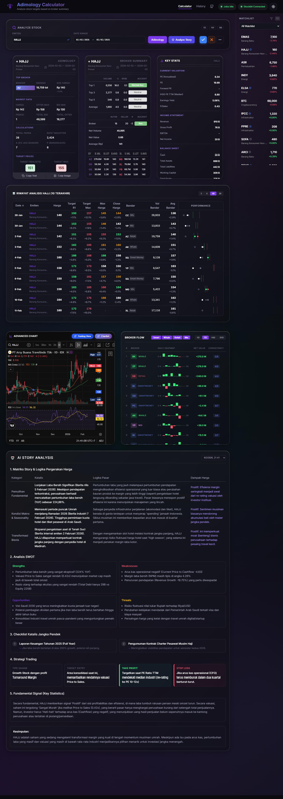

# Sahamology - Kalkulator Target Saham

> [!CAUTION]
> **PERINGATAN KEAMANAN**: Jangan pernah membagikan URL aplikasi Netlify Anda secara publik. Aplikasi ini melakukan sinkronisasi token sesi Stockbit Anda ke database. Jika URL bocor, orang lain dapat menyalahgunakan akses tersebut. Meski begitu, aplikasi ini tetap tidak bisa melakukan transaksi karena tidak bisa mengakses fitur PIN. Gunakan aplikasi ini hanya untuk penggunaan pribadi.

> [!IMPORTANT]
> **DISCLAIMER & TANGGUNG JAWAB**: Dengan menginstal dan menggunakan aplikasi ini, Anda menyatakan sadar dan setuju bahwa aplikasi ini akan menggunakan token sesi Stockbit Anda untuk keperluan sinkronisasi data. Pengguna memahami sepenuhnya cara kerja aplikasi ini dan membebaskan pengembang dari segala tuntutan hukum atau kerugian yang mungkin timbul. Pengembang tidak bertanggung jawab atas penyalahgunaan akses jika URL aplikasi Anda diketahui oleh pihak lain.

---

💡 **Credit Rumus**: Algoritma dan rumus analisis dalam aplikasi ini didasarkan pada metodologi dari **[Adi Sucipto](https://www.instagram.com/adisuciipto/)**.

---

## Changelog

### v0.4.3 (2026-09-06)
- **AI Story Anti-Stuck**: Kartu AI Story tidak lagi polling tanpa henti saat analisis macet di status `pending`/`processing` — polling otomatis menyerah setelah 3 menit dan menampilkan pesan error beserta tombol "Coba Lagi".
- **Trigger Background Function Diperkuat**: Pemanggilan Netlify background function untuk analisis kini di-`await`; jika gagal terkirim, status langsung ditandai error alih-alih diam-diam macet selamanya di `pending`.
- **Timeout Analisis Gemini**: Pemanggilan Gemini di background function dibatasi 4 menit, jadi permintaan yang menggantung tetap ditandai error alih-alih menggantung sampai batas keras eksekusi Netlify.

### v0.4.2 (2026-09-04)
- **BrokerFlowCard Migration**: Mengganti sumber data `BrokerFlowCard` dari API `tradersaham.com` (sudah tidak aktif) ke endpoint `running-trade-chart` milik Stockbit, tetap mempertahankan format heatmap harian & consistency yang ada.
- **Top 7 Broker Aktif**: Market Detector kini memilih 7 broker paling aktif (batas maksimal dari Stockbit) untuk window yang dipilih, lalu mengambil data net value harian untuk semuanya sekaligus.
- **Filter Window Disesuaikan**: Filter periode dikembalikan ke 1D/7D/14D/21D, dijangkarkan ke sesi trading terakhir yang sudah selesai (endpoint ini menolak tanggal hari berjalan).
- **Konfigurasi Model AI Story Analysis**: Model Gemini (`GEMINI_STORY_MODEL`) dan thinking level (`GEMINI_STORY_THINKING_LEVEL`) untuk fitur AI Story Analysis kini bisa diatur lewat environment variable, dengan fallback ke `gemini-3-flash-preview` / `HIGH`.

### v0.4.1 (2026-02-24)
- **Security Hardening**: Implementasi global API protection menggunakan **Next.js 16 Proxy**.
- **API Request Optimization**: Implementasi *request deduplication* pada indikator status dan pembatasan minimal 4 karakter pada input emiten untuk menghemat kuota request.

📜 Riwayat versi sebelumnya ada di **[CHANGELOG.md](CHANGELOG.md)**.

---

## Fitur Utama

- **Analisis Target**: Menghitung target harga "Realistis (R1)" dan "Maksimal" berdasarkan rata-rata harga pembelian broker (Avg Bandar).
- **Summary & Performance Dashboard**: Melacak hit rate target emiten dan dominasi bandar dalam rentang waktu tertentu.
- **Data Terintegrasi Stockbit**: Mengambil data transaksi broker summary.
- **History & Watchlist**: Menyimpan riwayat analisis untuk dipantau di kemudian hari.
- **Sync Watchlist & Hapus Otomatis**: Menampilkan watchlist langsung dari akun Stockbit termasuk fungsi delete.
- **Tracking Real Harga**: Otomatis memperbarui harga riil di hari bursa berikutnya untuk memverifikasi target.
- **Sistem Background Job & Retry**: Pemantauan status background job (analisis otomatis) dengan tombol **Retry** untuk menjalankan ulang job yang gagal.
- **Advanced Charts (TradingView & Chartbit)**:
  - Integrasi grafis dengan **Chartbit**.
  - Integrasi **TradingView Advanced Chart** dengan indikator RSI dan Oversold untuk konfirmasi sinyal Buy/Sell. Register ke https://www.tradingview.com/ untuk bisa melihat grafiknya.
- **Filter Flag & Watchlist**: Filter cepat berdasarkan flag emiten dan watchlist untuk mempermudah pemantauan portfolio.
- **Ringkasan Broker (Top 1, 3, 5)**: Visualisasi kekuatan akumulasi vs distribusi broker.
- **AI Story Analysis**: Analisis berita dan sentimen pasar menggunakan AI (Gemini) untuk merangkum story, SWOT, dan katalis emiten secara instan.
- **Multi-Version Analysis**: Menyimpan dan menampilkan riwayat analisis AI sebelumnya sehingga Anda bisa melacak perubahan narasi pasar dari waktu ke waktu.
- **Export to PDF**: Unduh laporan riwayat analisis dalam format PDF yang rapi.
- **Password Protection**: Proteksi keamanan akses aplikasi untuk menjaga privasi data dan token sesi Anda.

---

## Tech Stack

- **Frontend**: [Next.js 15 (App Router)](https://nextjs.org/), React 19, Tailwind CSS 4.
- **Backend/Database**: [Supabase](https://supabase.com/) (PostgreSQL).
- **Deployment**: [Netlify](https://www.netlify.com/) (dengan Netlify Functions & Scheduled Functions).
- **AI Engine**: [Google Gemini Pro](https://ai.google.dev/) dengan Google Search Grounding untuk data berita terkini.
- **Tools**: `jspdf`, `html-to-image`, & `html2canvas` untuk ekspor PDF dan capture image, `lucide-react` untuk ikon.

---

## Pilih Opsi Instalasi

Pilih salah satu opsi instalasi yang sesuai dengan kebutuhan Anda:

| | **OPSI A: CLOUD** | 💻 **OPSI B: LOKAL** |
|---|---|---|
| **Platform** | Netlify + Supabase | PC Lokal + Supabase |
| **Akses** | Dari mana saja via URL | Hanya dari PC Anda |
| **Scheduled Functions** | ✅ Otomatis jalan | ❌ Manual trigger |
| **Biaya** | Free tier tersedia | Gratis (self-hosted) |
| **Cocok untuk** | Penggunaan harian | Development/testing |

---

# OPSI A: Deploy ke Cloud (Netlify + Supabase)

Opsi ini direkomendasikan untuk penggunaan harian karena aplikasi akan berjalan secara otomatis di cloud dan dapat diakses dari mana saja.

👉 **[Lihat Panduan Deploy Cloud Selengkapnya](https://github.com/dikotiledon/sahamology/wiki/Deploy-Cloud)**

---

# OPSI B: Instalasi Lokal (PC + Supabase)

Opsi ini cocok untuk pengembangan atau jika Anda hanya ingin menjalankan aplikasi di komputer sendiri.

👉 **[Lihat Panduan Instalasi Lokal Selengkapnya](https://github.com/dikotiledon/sahamology/wiki/Deploy-Local)**

---

## Troubleshooting
 
👉 **[Punya masalah? Lihat Checkpoint Troubleshooting](https://github.com/dikotiledon/sahamology/wiki/Checkpoint)**

---

## Referensi Environment Variables

| Variable | Cloud | Lokal | Deskripsi |
|----------|:-----:|:-----:|-----------|
| `NEXT_PUBLIC_SUPABASE_URL` | ✅ | ✅ | URL project Supabase |
| `NEXT_PUBLIC_SUPABASE_ANON_KEY` | ✅ | ✅ | Anon key Supabase |
| `CRON_SECRET` | ✅ | ❌ | Secret untuk scheduled functions |
| `GEMINI_API_KEY` | ✅ | ✅ | API Key Google AI Studio |
| `GEMINI_STORY_MODEL` | ❌ | ❌ | Model Gemini untuk AI Story Analysis (default: `gemini-3-flash-preview`) |
| `GEMINI_STORY_THINKING_LEVEL` | ❌ | ❌ | Thinking level Gemini: `MINIMAL`/`LOW`/`MEDIUM`/`HIGH` (default: `HIGH`) |
| `LLM_PROVIDER` | ❌ | ❌ | `gemini` (default) atau `openai`. Mode `openai` memakai endpoint chat compatible dan tidak menjalankan Google Search |
| `LLM_BASE_URL` | ❌ | ❌ | Base URL OpenAI-compatible. Wajib saat `LLM_PROVIDER=openai`. Kode menambahkan `/chat/completions` |
| `LLM_API_KEY` | ❌ | ❌ | Bearer key untuk endpoint OpenAI-compatible. Wajib saat `LLM_PROVIDER=openai` |
| `LLM_MODEL` | ❌ | ❌ | Nama model di endpoint OpenAI-compatible. Wajib saat `LLM_PROVIDER=openai`; tidak ada default |
| `STOCKBIT_JWT_TOKEN` | ❌ | ⚠️ | Fallback token manual |

---

## Lisensi

Aplikasi ini dilisensikan di bawah MIT License.

Copyright (c) 2026 Bhakti Utama.

Izin diberikan, secara gratis, kepada siapa pun yang mendapatkan salinan perangkat lunak ini untuk menggunakannya tanpa batasan, termasuk hak untuk menggunakan, menyalin, memodifikasi, menggabungkan, menerbitkan, mendistribusikan, menyisipkan lisensi, dan/atau menjual salinan perangkat lunak ini. 

Proyek ini dibuat untuk tujuan edukasi dan penggunaan pribadi. Pastikan untuk mematuhi ketentuan penggunaan layanan pihak ketiga yang digunakan.
