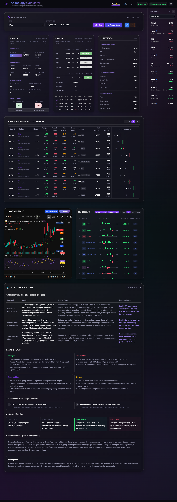

# Sahamology - Kalkulator Target Saham

> [!CAUTION]
> **PERINGATAN KEAMANAN**: Jangan pernah membagikan URL aplikasi Anda secara publik. Aplikasi ini melakukan sinkronisasi token sesi Stockbit Anda ke database. Jika URL bocor, orang lain dapat menyalahgunakan akses tersebut. Meski begitu, aplikasi ini tetap tidak bisa melakukan transaksi karena tidak bisa mengakses fitur PIN. Gunakan aplikasi ini hanya untuk penggunaan pribadi.

> [!IMPORTANT]
> **DISCLAIMER & TANGGUNG JAWAB**: Dengan menginstal dan menggunakan aplikasi ini, Anda menyatakan sadar dan setuju bahwa aplikasi ini akan menggunakan token sesi Stockbit Anda untuk keperluan sinkronisasi data. Pengguna memahami sepenuhnya cara kerja aplikasi ini dan membebaskan pengembang dari segala tuntutan hukum atau kerugian yang mungkin timbul. Pengembang tidak bertanggung jawab atas penyalahgunaan akses jika URL aplikasi Anda diketahui oleh pihak lain.

---

💡 **Credit Rumus**: Algoritma dan rumus analisis dalam aplikasi ini didasarkan pada metodologi dari **[Adi Sucipto](https://www.instagram.com/adisuciipto/)**.

---

## Changelog

### Unreleased / v0.6.0 (draft)
- **Honest Desk Phase 0**: Decision Card G0–G3 evaluator (`ENTER`/`WAIT`/`AVOID`/`TAKE_PROFIT`) berbasis Adi Sucipto math, journal persisten (`decision_journal`), price-history backfill worker (BullMQ), dan story-analysis schema alignment (`strategi_trading`).
- **Fix Kritis JSONB**: `saveDecisionJournal` kini men-serialize `gates` sebagai JSON valid (sebelumnya selalu `invalid input syntax for type json`).
- **Catatan jujur**: workflow CI (`.github/workflows/ci.yml`) sudah ditambahkan, tapi entri ini **tidak** mengklaim CI sudah berjalan hijau di GitHub. Seed hari libur IDX 2026 diisi dari SKB 3 Menteri 2026 via `api.kemendesa.link` (13 hari libur nasional; cuti bersama dikecualikan) — lihat `docs/R5-IDX-HOLIDAYS-BLOCKER.md`.

### v0.5.0 (2026-09-24)
- **Self-Hosted Migration**: Netlify + Supabase digantikan oleh stack self-hosted — Next.js (standalone) + PostgreSQL 16 + Redis 7 (BullMQ) dalam Docker Compose. Semua data kini diakses lewat native `pg` (`lib/db.ts`), migrasi SQL dijalankan oleh `scripts/run-migrations.js`, dan background worker (watchlist + story analysis) berjalan embedded di proses Next.js via `instrumentation.ts`.
- **OpenAI-Compatible LLM Support**: AI Story Analysis kini mendukung `LLM_PROVIDER=openai` (endpoint OpenAI-compatible) selain `gemini`. Konfigurasi lewat `LLM_BASE_URL`, `LLM_API_KEY`, dan `LLM_MODEL`.
- **Chrome Extension Token Syncer**: Ekstensi Manifest V3 (`stockbit-token-extension/dist/`) siap pakai untuk sinkronisasi token Stockbit ke `/api/update-token`.
- **Fix JSONB Persistence**: `updateAgentStory` kini men-serialize nilai array/object untuk kolom `jsonb` dengan benar (mencegah `invalid input syntax for type json` dari node-postgres).

### v0.4.3 (2026-09-06)
- **AI Story Anti-Stuck**: Kartu AI Story tidak lagi polling tanpa henti saat analisis macet di status `pending`/`processing` — polling otomatis menyerah setelah 3 menit dan menampilkan pesan error beserta tombol "Coba Lagi".
- **Trigger Background Function Diperkuat**: Pemanggilan Netlify background function untuk analisis kini di-`await`; jika gagal terkirim, status langsung ditandai error alih-alih diam-diam macet selamanya di `pending`.
- **Timeout Analisis Gemini**: Pemanggilan Gemini di background function dibatasi 4 menit, jadi permintaan yang menggantung tetap ditandai error alih-alih menggantung sampai batas keras eksekusi Netlify.

### v0.4.2 (2026-09-04)
- **BrokerFlowCard Migration**: Mengganti sumber data `BrokerFlowCard` dari API `tradersaham.com` (sudah tidak aktif) ke endpoint `running-trade-chart` milik Stockbit, tetap mempertahankan format heatmap harian & consistency yang ada.
- **Top 7 Broker Aktif**: Market Detector kini memilih 7 broker paling aktif (batas maksimal dari Stockbit) untuk window yang dipilih, lalu mengambil data net value harian untuk semuanya sekaligus.
- **Filter Window Disesuaikan**: Filter periode dikembalikan ke 1D/7D/14D/21D, dijangkarkan ke sesi trading terakhir yang sudah selesai (endpoint ini menolak tanggal hari berjalan).
- **Konfigurasi Model AI Story Analysis**: Model Gemini (`GEMINI_STORY_MODEL`) dan thinking level (`GEMINI_STORY_THINKING_LEVEL`) untuk fitur AI Story Analysis kini bisa diatur lewat environment variable, dengan fallback ke `gemini-3-flash-preview` / `HIGH`.

### v0.4.1 (2026-02-24)
- **Security Hardening**: Implementasi global API protection menggunakan **Next.js 16 Proxy**.
- **API Request Optimization**: Implementasi *request deduplication* pada indikator status dan pembatasan minimal 4 karakter pada input emiten untuk menghemat kuota request.

📜 Riwayat versi sebelumnya ada di **[CHANGELOG.md](CHANGELOG.md)**.

---

## Fitur Utama

- **Analisis Target**: Menghitung target harga "Realistis (R1)" dan "Maksimal" berdasarkan rata-rata harga pembelian broker (Avg Bandar).
- **Decision Card (Playbook G0–G4)**: Setiap analisis memunculkan stance deterministik (`ENTER` / `WAIT` / `AVOID` / `TAKE_PROFIT`) berdasarkan gate kuantitatif: integritas data (G0), kualitas broker akumulator Smartmoney/Whale (G1), ruang menuju ARA dan kesehatan buku (G2), risk-reward bersih ≥ 1.5 setelah friksi IDX dengan invalidation ATR(14) (G3), dan **tape filter 20-EMA + 3 pola allow-list** (G4, aktif di Phase 1). TradingView tidak pernah menjadi input gate — murni tampilan.
- **Baseline Backtest (Adi-Only)**: CLI `npm run baseline:backtest` mensimulasikan setiap sinyal harian terhadap candle 5 hari bursa berikutnya dan mempublikasikan expectancy, profit factor, win rate, serta touch R1. Setiap layer analisis baru wajib mengalahkan baseline ini out-of-sample sebelum di-merge.
- **G4 Walk-Forward**: CLI `npm run walkforward:g4` membandingkan kartu Phase 0 (G0–G3, stop interim) vs kartu Phase 1 (G0–G4, stop ATR) pada pemisahan kronologis 80/20 dengan purge gap 5 sesi bursa. Ship gate PASS hanya jika Phase 1 unggul expectancy & profit factor pada out-of-sample dengan ≥ 30 trade ENTER.
- **Persistensi & Micro (Phase 2, default-off)**: G1 membaca akumulasi/distribusi, persistensi bandar berulang, dan aliran broker akumulator teratas. `PLAYBOOK_G1_PROFILE` tetap `phase-1` sampai ship gate lulus, jadi perilaku live tidak berubah. CLI `npm run walkforward:p2` membandingkan kartu Phase 2 vs Phase 1 pada sinyal dan bar horizon yang identik. Selama sampel OOS masih di bawah 30 (Phase 2) / 50 (Phase 1) ENTER, reporter mencetak `SHIP_GATE=VERDICT_UNREACHABLE` — bukan `FAIL` — karena gate belum bisa dihakimi, bukan karena gagal.
- **Fundamental Veto (Phase 3, default-off)**: G5 menolak setup `ENTER` pada emiten distress — ekuitas negatif, leverage ekstrem, atau skor Altman Z negatif. Emiten keuangan (bank) **dikecualikan** lewat metrik regulator eksklusif, karena leverage bank yang sehat secara struktural tinggi. `PLAYBOOK_G5_PROFILE` default `off`; use `visible` untuk melihat skor tanpa veto, `veto` untuk mengaktifkannya. **Belum tervalidasi**: `npm run walkforward:p3` mencetak `VERDICT_UNREACHABLE` selama sampel OOS masih tumbuh, dan data historis ~14 bulan pertama memang tidak ada kolom fundamental. G5 hanya bisa menurunkan `ENTER` → `AVOID`, tidak pernah menaikkan; data hilang gagal *open*.
- **Price History & Backfill**: Tabel `price_history` menyimpan OHLCV harian per emiten; `npm run backfill:history` menarik riwayat dari Stockbit secara terpaginasi untuk menopang evaluasi sinyal tanpa lookahead.
- **Trading Journal**: Migrasi `020_decision_journal.sql` menyimpan audit trail stance, target, invalidation, dan hasil realisasi.
- **Summary & Performance Dashboard**: Melacak hit rate target emiten dan dominasi bandar dalam rentang waktu tertentu.
- **Data Terintegrasi Stockbit**: Mengambil data transaksi broker summary.
- **History & Watchlist**: Menyimpan riwayat analisis untuk dipantau di kemudian hari.
- **Sync Watchlist & Hapus Otomatis**: Menampilkan watchlist langsung dari akun Stockbit termasuk fungsi delete.
- **Tracking Real Harga**: Otomatis memperbarui harga riil di hari bursa berikutnya untuk memverifikasi target.
- **Sistem Background Job & Retry**: Pemantauan status background job (analisis otomatis) dengan tombol **Retry** untuk menjalankan ulang job yang gagal.
- **Advanced Charts (TradingView & Chartbit)**:
  - Integrasi grafis dengan **Chartbit**.
  - Integrasi **TradingView Advanced Chart** (widget embed) sebagai **tampilan saja**. Indikator RSI/oversold di chart tidak pernah dipakai sebagai input Decision Card; semua angka gate dihitung deterministik dari `lib/tape` dan `lib/playbook`, bukan dari iframe TradingView.
- **Filter Flag & Watchlist**: Filter cepat berdasarkan flag emiten dan watchlist untuk mempermudah pemantauan portfolio.
- **Ringkasan Broker (Top 1, 3, 5)**: Visualisasi kekuatan akumulasi vs distribusi broker.
- **AI Story Analysis**: Analisis berita dan sentimen pasar menggunakan AI (Gemini) untuk merangkum story, SWOT, dan katalis emiten secara instan. Model AI **dilarang** memproduksi angka harga (entry/take-profit/stop-loss); seluruh level harga dihitung deterministik oleh `lib/calculations.ts` dan `lib/playbook.ts`.
- **Multi-Version Analysis**: Menyimpan dan menampilkan riwayat analisis AI sebelumnya sehingga Anda bisa melacak perubahan narasi pasar dari waktu ke waktu.
- **Export to PDF**: Unduh laporan riwayat analisis dalam format PDF yang rapi.
- **Password Protection**: Proteksi keamanan akses aplikasi untuk menjaga privasi data dan token sesi Anda (scrypt, migrasi otomatis dari SHA-256 lama).

---

## Tech Stack

- **Frontend**: [Next.js 16 (App Router)](https://nextjs.org/), React 19, Tailwind CSS 4.
- **Backend/Database**: PostgreSQL 16 via native `pg` (`lib/db.ts`), migrations dari `supabase/*.sql`.
- **Deployment**: Docker Compose (app + PostgreSQL + Redis), atau PM2 (`ecosystem.config.js`) dengan Next.js standalone output.
- **Queue/Background**: Redis 7 + BullMQ, worker embedded di proses Next.js (`instrumentation.ts`).
- **AI Engine**: [Google Gemini](https://ai.google.dev/) dengan Google Search Grounding, atau endpoint OpenAI-compatible (`LLM_PROVIDER=openai`).
- **Tools**: `jspdf`, `html-to-image`, & `html2canvas` untuk ekspor PDF dan capture image, `lucide-react` untuk ikon.

---

## Pilih Opsi Instalasi

Pilih salah satu opsi instalasi yang sesuai dengan kebutuhan Anda:

| | **OPSI A: CLOUD / VPS** | 💻 **OPSI B: LOKAL** |
|---|---|---|
| **Platform** | Docker Compose di server publik | Docker Compose di PC |
| **Akses** | Dari mana saja via URL | Hanya dari komputer Anda |
| **Scheduled Jobs** | ✅ Otomatis (BullMQ cron) | ✅ Otomatis (BullMQ cron) |
| **Biaya** | Sesuai biaya server | Gratis (self-hosted) |
| **Cocok untuk** | Penggunaan harian | Development/testing |

---

# OPSI A: Deploy ke Cloud / VPS (Docker + PostgreSQL)

Opsi ini direkomendasikan untuk penggunaan harian karena aplikasi akan berjalan secara otomatis di server dan dapat diakses dari mana saja.

👉 **[Lihat Panduan Deploy Cloud Selengkapnya](https://github.com/dikotiledon/sahamology/wiki/Deploy-Cloud)**

---

# OPSI B: Instalasi Lokal (Docker + PostgreSQL)

Opsi ini cocok untuk pengembangan atau jika Anda hanya ingin menjalankan aplikasi di komputer sendiri.

👉 **[Lihat Panduan Instalasi Lokal Selengkapnya](https://github.com/dikotiledon/sahamology/wiki/Deploy-Local)**

---

## Self-Hosted Runbook (Lengkap)

Panduan operasional lengkap (arsitektur, topologi jaringan, perintah verifikasi, troubleshooting) tersedia di:

👉 **[Self-Hosted Runbook](https://github.com/dikotiledon/sahamology/wiki/Self-Hosted)**

---

## Troubleshooting
 
👉 **[Punya masalah? Lihat Checkpoint Troubleshooting](https://github.com/dikotiledon/sahamology/wiki/Checkpoint)**

---

## Referensi Environment Variables

| Variable | Cloud | Lokal | Deskripsi |
|----------|:-----:|:-----:|-----------|
| `POSTGRES_PASSWORD` | ✅ | ✅ | Password database PostgreSQL |
| `APP_BASE_URL` | ✅ | ✅ | URL publik aplikasi (contoh: `http://192.168.1.4:3000`) |
| `CRON_SECRET` | ✅ | ✅ | Secret untuk trigger cron/worker |
| `AUTH_SECRET` | ✅ | ✅ | Secret HMAC untuk sesi login |
| `GEMINI_API_KEY` | ⚠️ | ⚠️ | API Key Google AI Studio (provider `gemini`) |
| `GEMINI_STORY_MODEL` | ❌ | ❌ | Model Gemini untuk AI Story Analysis (default: `gemini-3-flash-preview`) |
| `GEMINI_STORY_THINKING_LEVEL` | ❌ | ❌ | Thinking level Gemini: `MINIMAL`/`LOW`/`MEDIUM`/`HIGH` (default: `HIGH`) |
| `LLM_PROVIDER` | ❌ | ❌ | `gemini` (default) atau `openai`. Mode `openai` memakai endpoint chat compatible dan tidak menjalankan Google Search |
| `LLM_BASE_URL` | ❌ | ❌ | Base URL OpenAI-compatible. Wajib saat `LLM_PROVIDER=openai`. Kode menambahkan `/chat/completions` |
| `LLM_API_KEY` | ❌ | ❌ | Bearer key untuk endpoint OpenAI-compatible. Wajib saat `LLM_PROVIDER=openai` |
| `LLM_MODEL` | ❌ | ❌ | Nama model di endpoint OpenAI-compatible (contoh: `power`, `agmanager/gemini-3.8-flash-high`). Wajib saat `LLM_PROVIDER=openai`; tidak ada default |
| `STOCKBIT_JWT_TOKEN` | ❌ | ⚠️ | Fallback token manual |

---

## Lisensi

Aplikasi ini dilisensikan di bawah MIT License.

Copyright (c) 2026 Bhakti Utama.

Izin diberikan, secara gratis, kepada siapa pun yang mendapatkan salinan perangkat lunak ini untuk menggunakannya tanpa batasan, termasuk hak untuk menggunakan, menyalin, memodifikasi, menggabungkan, menerbitkan, mendistribusikan, menyisipkan lisensi, dan/atau menjual salinan perangkat lunak ini. 

Proyek ini dibuat untuk tujuan edukasi dan penggunaan pribadi. Pastikan untuk mematuhi ketentuan penggunaan layanan pihak ketiga yang digunakan.
